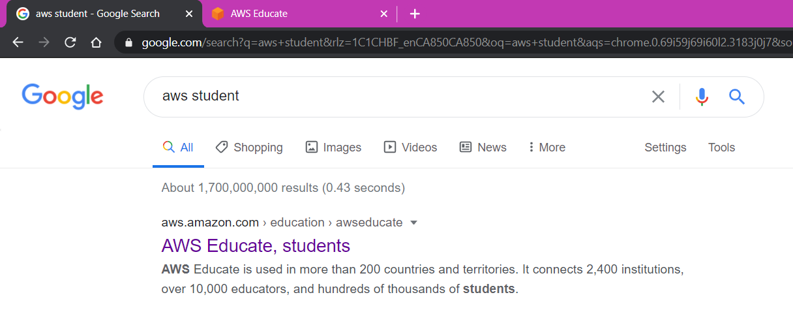
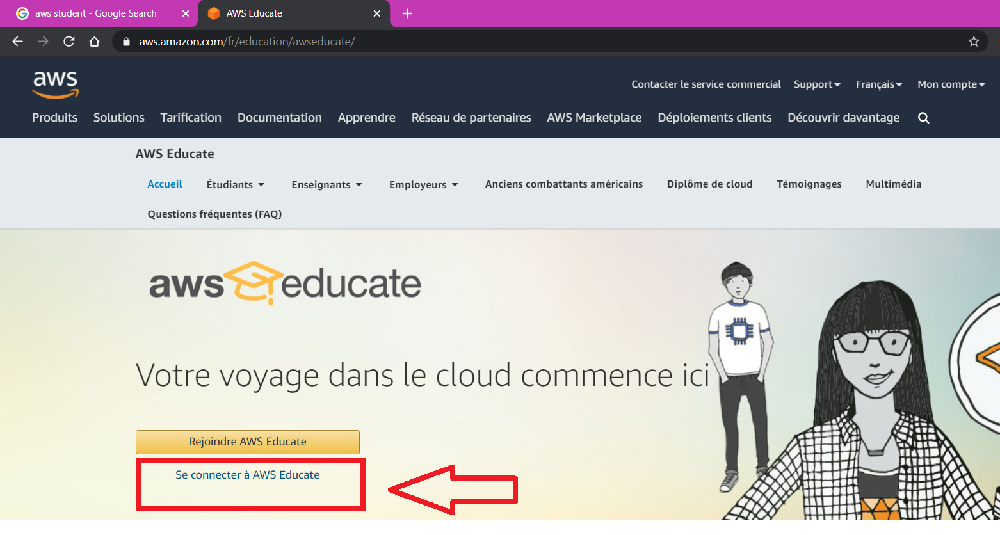
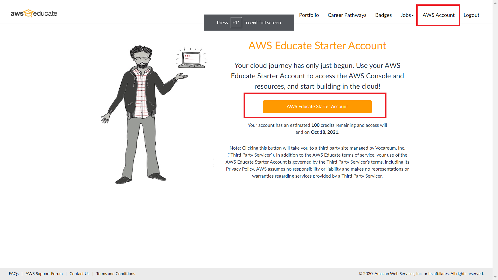
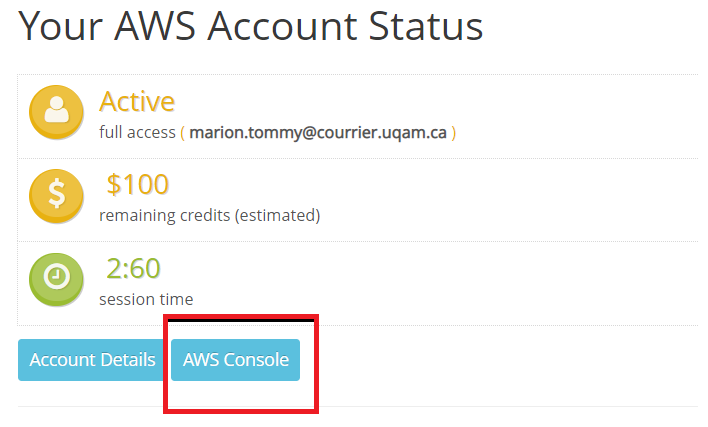
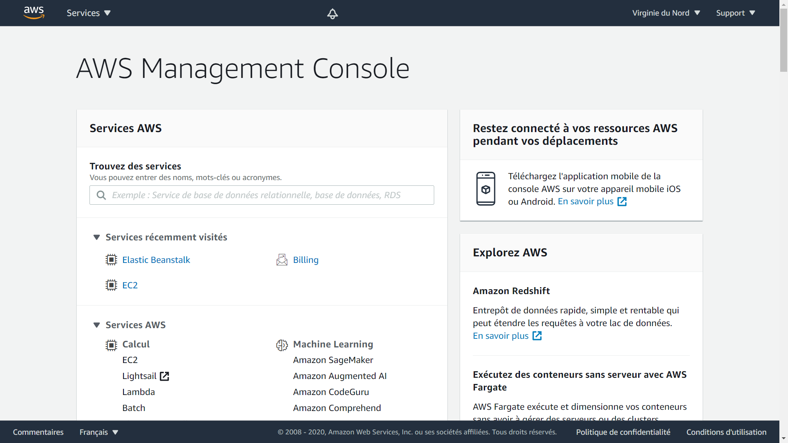

La connection est similaire à l'inscription.
Se connecter directement à partir d'AWS ne fonctionnera pas, puisqu'on utilise un service tiers pour se connecter(vocareum)

1. Aller sur le site d'AWS educate

2. Se connecter avec le compte créé précédemment

3. Aller sur AWS

4. Aller sur la console AWS

5. Vous êtes sur la bonne page

