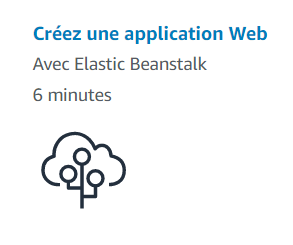
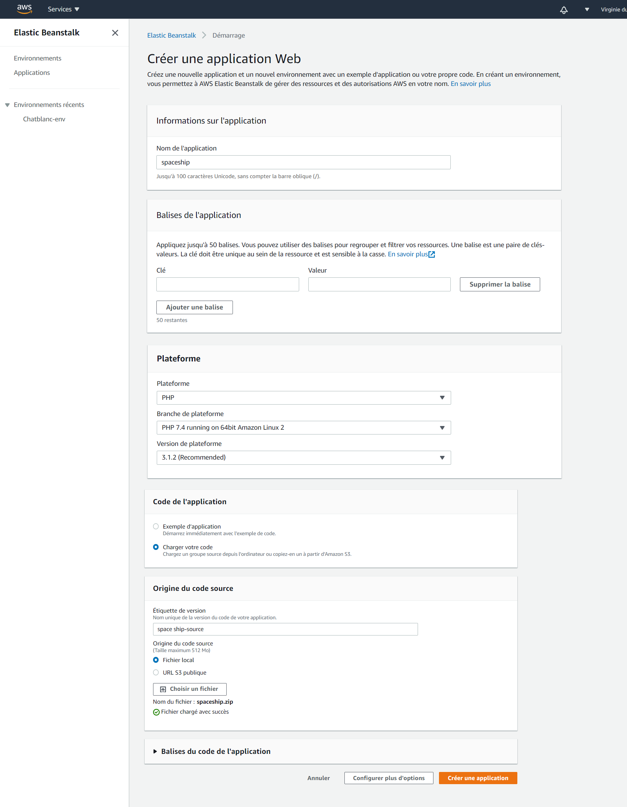
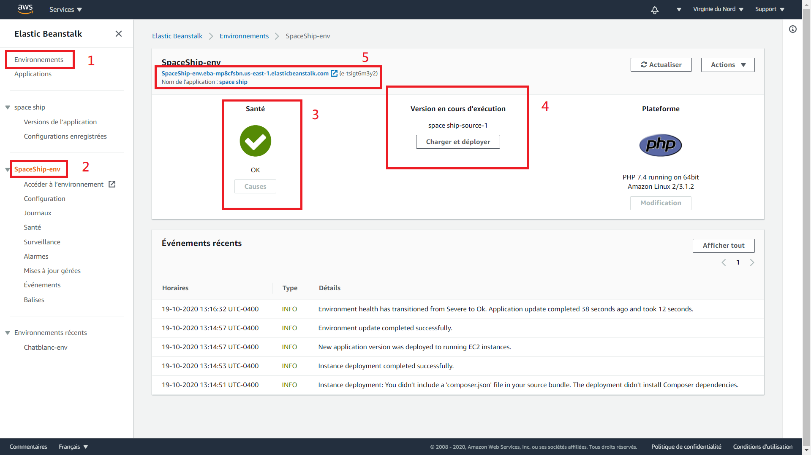
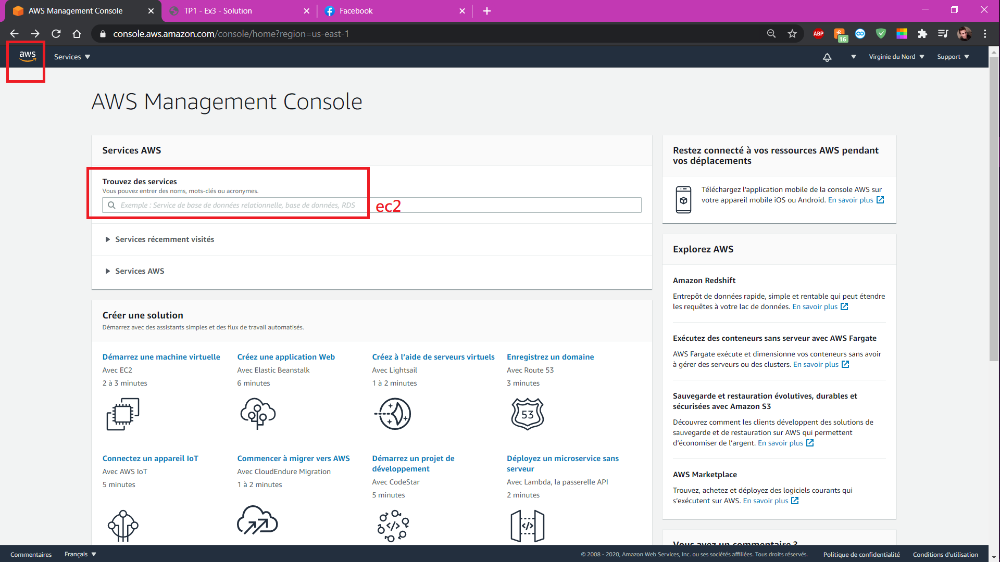
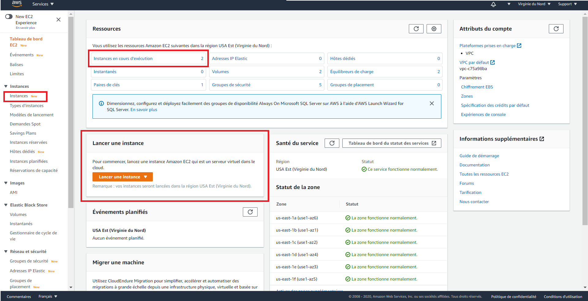
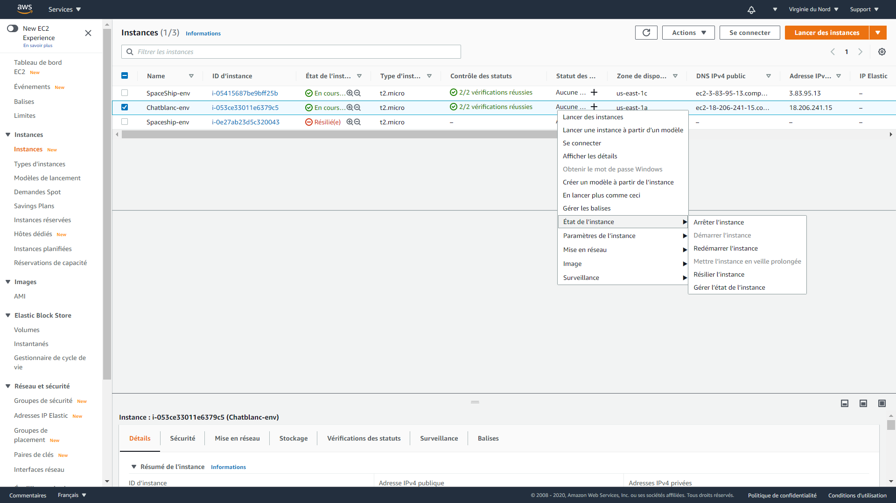

## Spaceship sur Elastic Beanstalk

L'objectif est de se familiariser avec AWS.

Le projet que nous voulons mettre sur le web sera le jeu de **Spaceship(spaceship.html)**

1. Se connecter à la console AWS
1. Choisir un serveur proche de la position des utilisateurs de l'application web(dans notre cas, il n'y aura personne qui va y accéder).
Même si Canada semble être un bon choix, la Virgine du Nord m'a donné de meilleurs résultats.

    
    
3. Une norme html veut que le fichier d'entrée du site web soit nommé index.html. Puisque nous n'avons qu'un seul fichier, on doit renommer **spaceship.html** en **index.html**.

3. Les fichiers HTML sur le serveur doivent être compressés dans une archive zip.
    Il faut donc compresser index.html en **un_nom_significatif.zip**
    
3. On peut maintenant créer une application web EC2 avec Elastic Beanstalk.

    
    

## Instance
Maintenant qu'on a notre instance de serveur démarée :
    
1. Représente la liste des environnements. En effet, il est possible de créer plusieurs instances différentes de serveur web en même temps et elles sont toutes représentées ici.
2. Le nom de l'environnement actuel. On peut le configurer de plein de façons.
3. Représente l'état du système à ce moment.
4. Le bouton "Charger et déployer" permet de changer le code source de l'environnement. Ça peut être utile si la santé n'est pas OK.
5. C'est le lien qui peut être utilisé pour accéder au site. Il est publique et accessible par TOUT le monde qui a le lien.

Félicitation, vous avez configurer votre premier site.

## Gestion
Puisque Elastic Beanstalk hérite de EC2, il est un serveur EC2.

Il est possible ici d'arrêter l'instance, d'en démarer une, de la résilier(supprimer).
