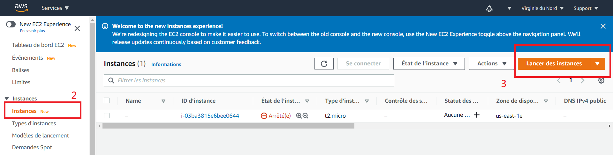
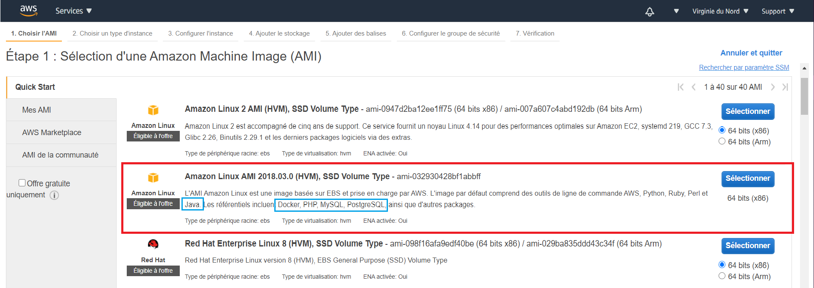
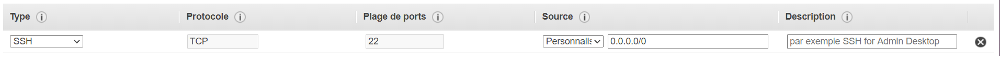
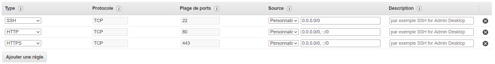
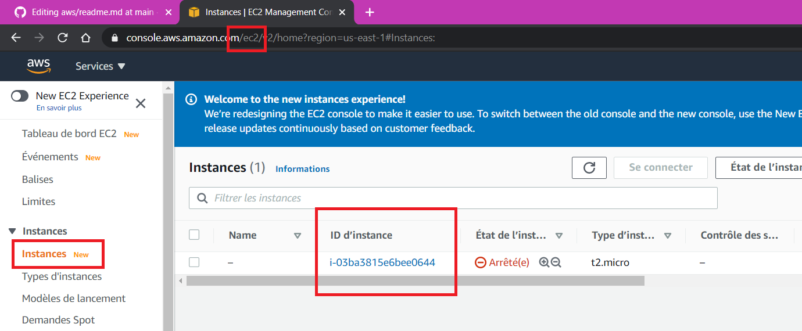
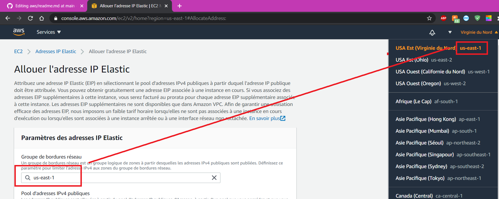
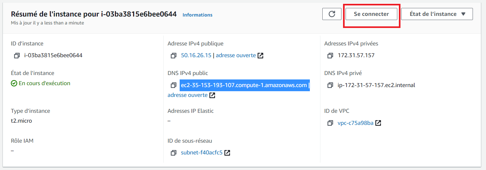
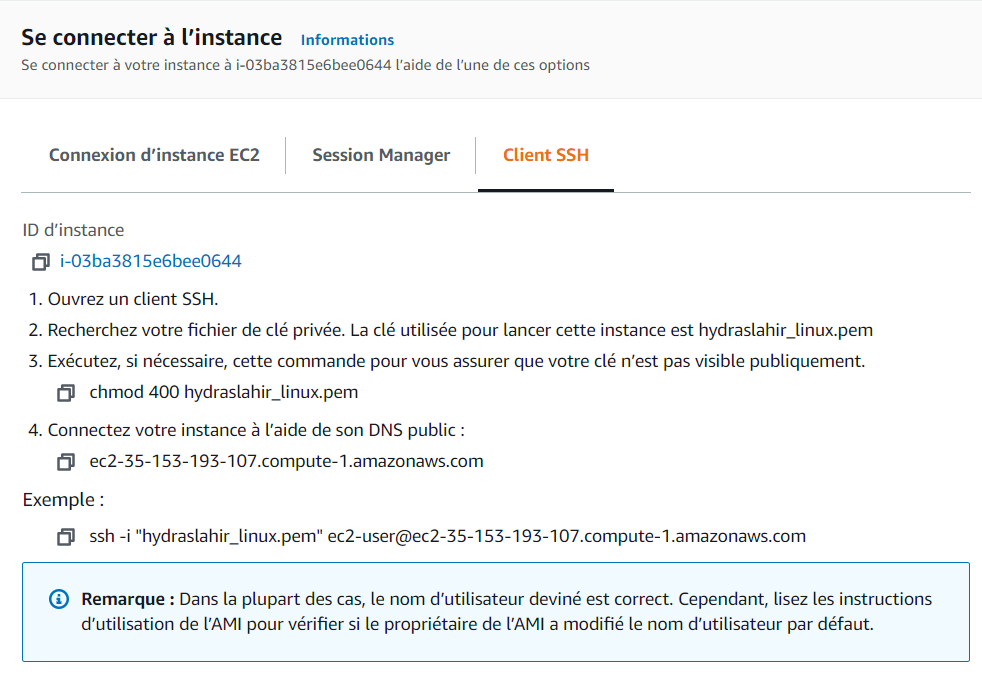

Elastic Beanstalk est un serveur EC2 qui contient les fichiers de configuration nécessaires pour créer un site web.
Ici, nous allons créer un serveur EC2 qui contient linux

### 1. EC2
1. Connectez-vous sur votre compte AWS et allez dans les services EC2
1. Cliquez sur "Instances" et "lancer des instances"

### 2. Selectionner AMI
AMI (Amazon machine image) possède l'information nécessaire pour lancer une instance. La plupart du temps ce sera un système d'exploitation.
Il y a beaucoup de choix, notamment:
* Linux AMI (défaut)
* Ubuntu Server (pour les serveurs)
* Red Hat
* Windows

Il y a aussi des serveurs préconfigurés (comme Elastic Beanstalk pour le web).
Il y a des serveurs gratuits dans le Marketplace qui pourraient être intéressants aussi.

Dans mon cas, j'ai choisi la 2e qui contient déjà des configurations pour Java, Docker, PHP et d'autres éléments utiles.

### 3. Sélectionner type d'instance
Il faut choisir la famille
(Pour plus d'info :: [Type d'instances Amazon](https://aws.amazon.com/fr/ec2/instance-types/))

|Famille            | Utilisation |
|:------------------|:------------|
|Usage général      | ...         |
|Calcul optimisé    |Optimisé pour le #instructions/seconde|
|Mémoire optimisée  |Grande quantité de mémoire vive|
|Calcul accéléré    |Machine learning|
|Stokage optimisé   |Mémoire et vitesse d'accès mémoire|

Dans notre cas, t2(usage général) et micro nous suffiront.

### 4. Autres onglets
3. Configuration (pas nécessaire pour nous)
4. Stokage (Combien de mémoire avez-vous de besoin ?)
5. Balises (inutile dans notre cas)

### 5 Groupe de sécurité
Par défaut, vous aurez : 

Cela est suffisant pour notre utilisation basique. Néanmoins, si vous voulez être en mesure de créer un site sur votre serveur linux(ce que nous ne ferons pas ici), vous devriez ajouter HTTP et HTTPS dans les types.

D'aileurs, d'un point de vue de sécurité, de permettre à toutes les IP (avec 0.0.0.0/0) d'accéder au serveur n'est pas sécuritaire, considérez ce détail lorsque vous voudrez faire un vrai projet.

### 6 Générer une paire de clés
La clé privée vous permettra de vous connecter en SSH sur votre serveur.
Si vous voulez plus d'information sur ce qu'est une clé publique/privée, vous pouvez faire le cours INF4471.

Pour résumer:
* Les clés publiques et privées viennent en paires.
* Une clé publique permet de coder un message ( [chaton]_pub --> A431%?BC84), mais ne peut pas les décoder.
* Une clé privée permet de décoder un message ( [A431%?BC84]_priv --> chaton)

Ainsi, tout le monde peut coder des messages pour un destinataire, mais seul le destinataire, possédant la clé privée, peut les décoder.

En créant une paire de clés, vous allez obtenir un fichier "nom_de_la_paire_de_clé.pem", c'est une clé privée qui va vous permettre de dire au serveur que vous êtes le créateur de la paire de clé et que vous êtes authentique. **Si vous perdez ce fichier ou que vous vous le faites voler, vous perdez votre serveur**.

Entreposez cette clé dans un répertoire sécuritaire dans votre ordinateur.

### 7 Tester votre connection SSH
1. Si vous avez fait les @bandits, elle fonctionne déjà, passez à l'étape suivante
2. Sinon : Testez d'abord si vous êtes en mesure de vous connecter au serveur Java de l'uqam

Remplacez aa123456 et AAA12345 par vos identifiants équivalents de l'Uqam

> $ ssh aa123456@java.labunix.uqam.ca

mot de passe  :: AAA12345
ici, l'utilisateur est aa123456, l'addresse est java.labunix.uqam.ca et le mot de passe est AAA12345

### 7.5 (optionnel) Configurer une addresse IP élastique
L'addresse IP du serveur change à chaque fois qu'il est ré-activé. Il y a un moyen plutôt simple pour fixer une addresse à un serveur.
1. Allez dans Addresse IP Elastic
2. Allouer l'addresse IP Elastic

3. S'assurer que c'est la bonne zone

4. Une fois allouée, il faut l'associer.
    Action --> Associer l'addresse IP Elastic
    
5. Choisir la bonne instance

Voilà, vous avez une instance de EC2 qui roule linux et dont le DNS est constant!
Prennez note que des addresses IP Elastic non utilisées vous coûtent de l'argent(environ 1$/jour)

### 8 Obtenir l'addresse DNS du serveur
pour vous connecter au serveur que vous venez de créer, vous devez savoir son nom de dommaine.
Dans la page EC2, cliquez sur l'ID d'instance.

### 9 Se connecter
En appuyant sur "Se connecter" --> "SSH", vous allez avoir le liste des étapes restantes pour vous connecter.

### 10(optionnel)(TODO) Configurer Docker
1. Dans la console du serveur que vous avez créé:

|Commande                               |  Explication              |
|:--------------------------------------|:--------------------------|
|:: sudo yum install docker              | Installe Docker avec yum  |
|:: sudo groupadd docker                 | Créé un nouveau groupe nommé "docker"|
|:: sudo usermod -aG docker ${USER}      | (-a) append, -G(to group) : append le groupe docker à USER|

Vous pouvez maintenant exécuter des contenants Docker sur votre serveur.

