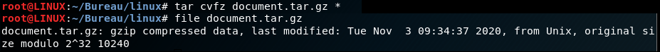
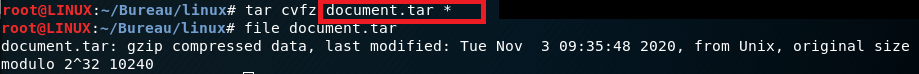
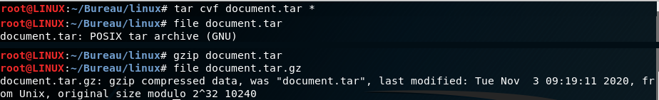
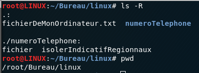
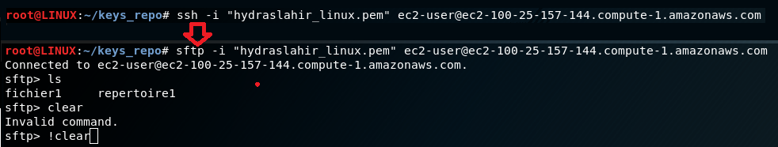
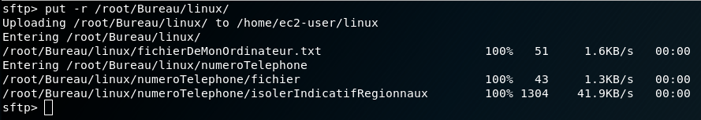

L'objectif de cet exercise est d'apprendre à transférer des fichiers entre le local et le serveur.

## Rappel : Compresser
Compresser peut être utile lorsque vous trasférez des fichier volumineux.

### gzip
Permet de compresser un fichier
$ gzip fichier

### tar
Les fichiers tar sont des **archives** qui facilient la portabilité. Ils compressent légèrement les fichiers, mais leurs usages se limitent générallement à regrouper les fichiers proprement.

> $ tar cvf ou quoi
* ou : Représente l'extrant: le résultat et sa destination. 
Si vous désirez créer une archive "document.tar" dans le répertoire "/home/Bureau/", il faudra tout concaténer. "/home/Bureau/document.tar".
* quoi : représente ce qui sera archivé. Généralement, ce sera le contenu du répertoire courant (\*)

* options
  * -c : "c"réer une nouvelle archive
  * -v : "v"erveux : affiche le progrès de l'archivage
  * -f : "f"ilename : spécifier le nom de l'archive
  * -z : "z"ip compression.

### compresser avec tar
* avec tar cvfz en une étape

* ATTENTION À L'EXTENTION, si c'est en une étape, vous devez avoir l'extension "tar.gz". Sinon, les conventions d'extensions ne seront pas respectées.

* avec tar cvf et gzip en deux étapes

## Décompresser
$ gunzip fichier.tar.gz

$ tar xvf fichier.tar

## SFTP :: Transférer Local --> Serveur
L'objectif est de déplacer les fichiers de notre ordinateur vers le serveur distant.

Avant tout, vous devriez vérifier l'état de votre serveur.

Voici le contenu d'un répertoire local que je veux transférer en sftp.
Notez ls -R qui liste récursivement et pwd qui me donne le chemin absolu du répertoire.

Pour se connecter en SFTP, il suffit de remplacer SSH par SFTP.
Vous remarquerez que l'interface est différente et que certaines méthodes, notamment clear, ne fonctionnent pas.
Vous pouvez faire !clear pour clear.

Afin de transférer ce répertoire vers le serveur, il suffit d'utiliser "put -r" et le chemin absolu.

## SCP :: Transférer Serveur --> Local
L'objectif est de télécharger des fichiers qui sont dans le serveur.

Il faut avoir le chemin absolu du fichier désiré sur le serveur.
On peut penser que la racine est le répertoire principal, mais ce n'est pas le cas.

> $ pwd

> /home/ec2-user

la racine est /home/ec2-user
Le fichier qui m'intéresse est /home/ec2-user/fichier1

### scp
$ scp connection:/origine destination

Ainsi, pour le fichier1
* la connection demeure la même qu'avant 
* l'origine est /home/ec2-user/fichier1
* la destination, dans mon cas est '.'

